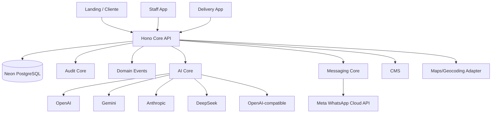

# System Architecture

## Arquitectura objetivo



## Runtime

- Vercel para frontend/API.
- Hono sobre Vercel Functions Node.js.
- Neon PostgreSQL.
- Conexión pooled/serverless.
- Storage externo para imágenes, PDFs, exports y assets.
- No Edge runtime como dependencia arquitectónica.

## Monorepo recomendado

```text
/apps
  /web                 # React/Vite: landing, cliente, staff, delivery
  /api                 # Hono

/packages
  /db                  # Drizzle schema, migrations, repositories
  /domain              # entidades/servicios/reglas
  /contracts           # Zod schemas / DTO
  /auth
  /rbac
  /audit
  /events
  /messaging
  /ai
  /cms
  /maps
  /storage
  /ui
  /config
  /observability

/docs
```

Puede separarse `web` en apps distintas más adelante si tamaño/deploy lo justifican. Inicialmente se prioriza compartir UI, auth y contratos.

## Principio de adaptadores

Interfaces obligatorias:

- `AIProvider`
- `MessagingProvider`
- `GeocodingProvider`
- `RouteOptimizationProvider`
- `ObjectStorageProvider`

## Eventos de dominio iniciales

- `CUSTOMER_CREATED`
- `CUSTOMER_UPDATED`
- `CUSTOMER_MERGED`
- `CUSTOMER_UNMERGED`
- `MESSAGE_RECEIVED`
- `MESSAGE_SENT`
- `ORDER_DRAFT_CREATED`
- `ORDER_CONFIRMED`
- `ORDER_UPDATED`
- `ORDER_CANCELLED`
- `ORDER_READY`
- `ORDER_DELIVERED`
- `PAYMENT_RECORDED`
- `CASH_COLLECTED`
- `CASH_SETTLED`
- `SALES_CYCLE_OPENED`
- `SALES_CYCLE_CLOSED`
- `KITCHEN_SNAPSHOT_CREATED`
- `PRODUCTION_REPORTED`
- `SURPLUS_UPDATED`
- `ROUTE_PUBLISHED`
- `DELIVERY_MESSAGE_TRIGGERED`
- `CMS_PUBLISHED`
- `AI_EXECUTED`

## Procesamiento asíncrono

No bloquear requests largos para:

- envíos masivos;
- generación de documentos;
- generación de imágenes;
- reintentos de mensajes;
- procesamiento de webhooks;
- tareas IA costosas.

Diseñar una abstracción `JobQueue` aunque la implementación inicial pueda ser simple.

## No-serverless

V1 debe intentar **cero VPS**. Si posteriormente una integración requiere proceso persistente, se despliega como gateway aislado, sin convertirlo en fuente de verdad y con acceso mínimo al Core API.
