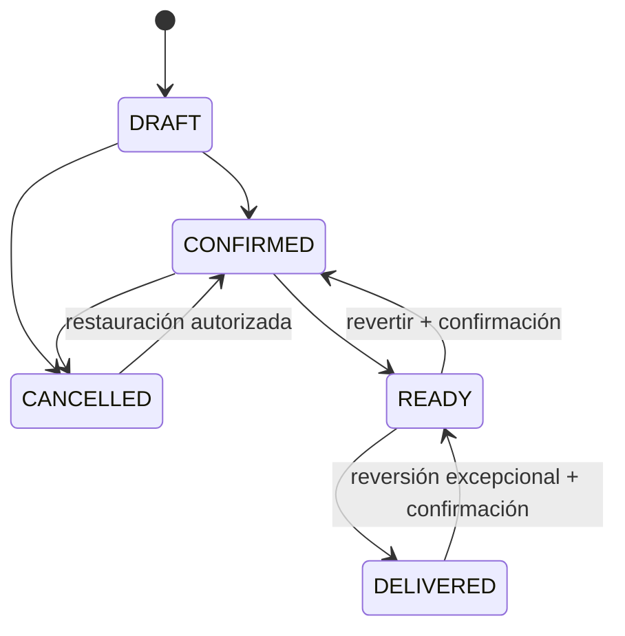

# State Machines

## Order



Reglas:

- `DELIVERED` no puede pasar a `CANCELLED`.
- Reversiones requieren confirmación explícita y auditoría.
- Cocina no necesita estados intermedios.
- Cambios posteriores al cierre semanal son excepcionales y auditados.

## Payment

```text
PENDING
  -> PAID
  -> TO_SETTLE (repartidor cobró efectivo)
TO_SETTLE
  -> PAID (efectivo rendido/recibido)
```

No inferir pago desde estado de pedido.

## SalesCycle

```text
DRAFT -> OPEN -> LOCKED -> PRODUCTION/DELIVERY -> CLOSED
```

El detalle final puede ajustarse durante implementación, manteniendo:

- martes 20:00 snapshot parcial;
- miércoles 19:00 cierre.

## Conversation

```text
NEW -> OPEN -> WAITING_CUSTOMER -> RESOLVED
```

Asignación a operador es opcional. Varias personas pueden responder.

## CMS

```text
DRAFT -> PUBLISHED -> ARCHIVED
```

Publicación genera revisión.

## Marketing consent

```text
UNKNOWN -> OPTED_IN
UNKNOWN -> OPTED_OUT
OPTED_IN -> OPTED_OUT
OPTED_OUT -> OPTED_IN (nuevo consentimiento explícito)
```

Un mensaje `BAJA` provoca opt-out inmediato. Una nueva interacción comercial no equivale automáticamente a nuevo consentimiento de marketing.
