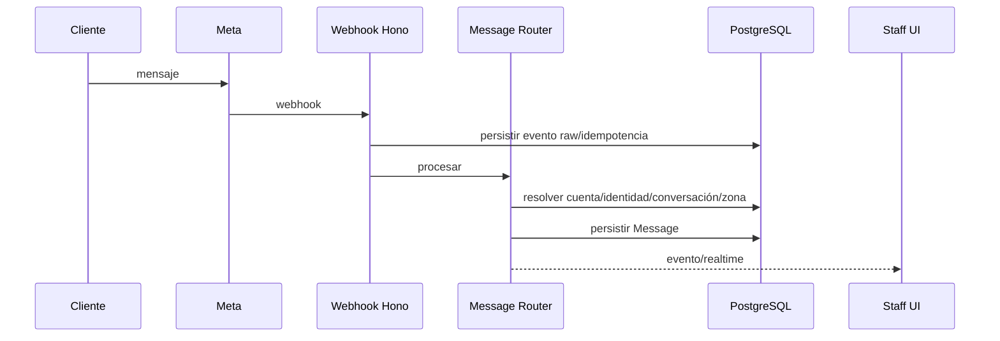

# Messaging Core - WhatsApp V1

## Alcance realista V1

- múltiples números/cuentas WhatsApp oficiales;
- webhook central;
- routing por `phone_number_id`;
- inbox unificado;
- conversaciones;
- cliente nuevo/existente;
- varios operadores;
- registro interno de quién respondió;
- envío de texto;
- plantillas internas;
- plantillas oficiales Meta cuando correspondan;
- estados de entrega cuando Meta los reporte;
- creación de pedido desde conversación;
- IA para redactar/extraer;
- triggers de reparto;
- mensajes automáticos configurables por evento.

## Arquitectura



## Routing

Orden:

1. verificar webhook;
2. idempotencia por ID externo;
3. resolver `MessagingAccount`;
4. resolver `CustomerIdentity`;
5. crear cliente incompleto si no existe;
6. resolver conversación abierta;
7. resolver zona operativa;
8. persistir mensaje;
9. emitir `MESSAGE_RECEIVED`;
10. ejecutar clasificación/IA no bloqueante.

### Cuenta vs zona

- `inboundAccount`: número/cuenta que recibió.
- `operationalZone`: zona logística/comercial real.

No son equivalentes.

## Cliente nuevo

Crear `Customer` incompleto + `CustomerIdentity(WHATSAPP)`.
El operador completa nombre/dirección/datos.

## Multioperador

- todos pueden ver conversaciones autorizadas;
- `handledBy`/`lastHandledBy`;
- presencia "X está respondiendo";
- no bloquear por defecto;
- UI realtime para evitar respuestas dobles.

## Outbound

Toda salida pasa por `MessagingService`, nunca directamente desde UI.

```text
UI -> API -> policy/template -> customer identity -> messaging account -> provider -> Meta
```

## Repartidor

El endpoint de reparto recibe un `DeliveryStop` y dispara una acción semántica:

- `ON_MY_WAY`
- `AT_ADDRESS`
- `DELIVERED_THANKS`

El cliente destino se resuelve en backend. El número no llega al dispositivo del repartidor.

## Futuro

Agregar adaptadores:

- Instagram
- Messenger
- Email

El dominio no debe usar nombres `WhatsAppMessage`; usar `Message`.

## As built (Fase 5 — esqueleto)

Tablas `messaging_accounts`, `messaging_conversations`, `messaging_messages`,
`messaging_webhook_events` (migración 0019, additiva). Servicio `PostgresMessagingService`; adapter
real `MetaWhatsAppProvider` (`apps/api/src/integrations/whatsapp-provider.ts`).

- **Funciona sin credenciales reales**, mismo patrón que geocoding/IA/avatar storage: sin
  `WHATSAPP_APP_SECRET`/`WHATSAPP_WEBHOOK_VERIFY_TOKEN` configurados, el webhook existe pero rechaza
  toda verificación — _deny by default_, no un 500.
- **Múltiples cuentas** (`messaging_accounts`) es dato administrable — cada fila tiene su propio
  `phoneNumberId`/`accessToken`, no un único secreto global. Los dos secretos que sí son a nivel de
  la App de Meta (firma del webhook, verify token) sí viven en env.
- **Routing** sigue el orden documentado arriba: idempotencia (por `messaging_webhook_events` ↔
  external id de Meta) → resolver cuenta por `phone_number_id` → resolver/crear identidad
  `whatsapp` (crea un Customer incompleto si es contacto nuevo, mismo patrón que el guest checkout)
  → resolver/crear conversación abierta → persistir mensaje. Un evento `statuses[]` de Meta
  actualiza el mensaje saliente por external id, sin tocar conversaciones.
- **Outbound siempre pasa por el mismo servicio**, nunca directo desde la UI — `sendMessage` para
  responder dentro de una conversación existente, `sendToCustomer` para un envío iniciado por el
  sistema (usado por los triggers de reparto en Fase 8) que resuelve o crea la conversación.
- Inbox en `/app/mensajes`, cuentas en `/app/ajustes/mensajes`. Permisos `messages.read`/
  `messages.send`/`messaging.accounts.manage` (ya reservados).

**Diferido**: adaptadores de media/mensajes interactivos, IA para redactar/extraer sobre estos
mensajes, plantillas oficiales Meta, disparadores automáticos por evento más allá de los tres de
reparto.
